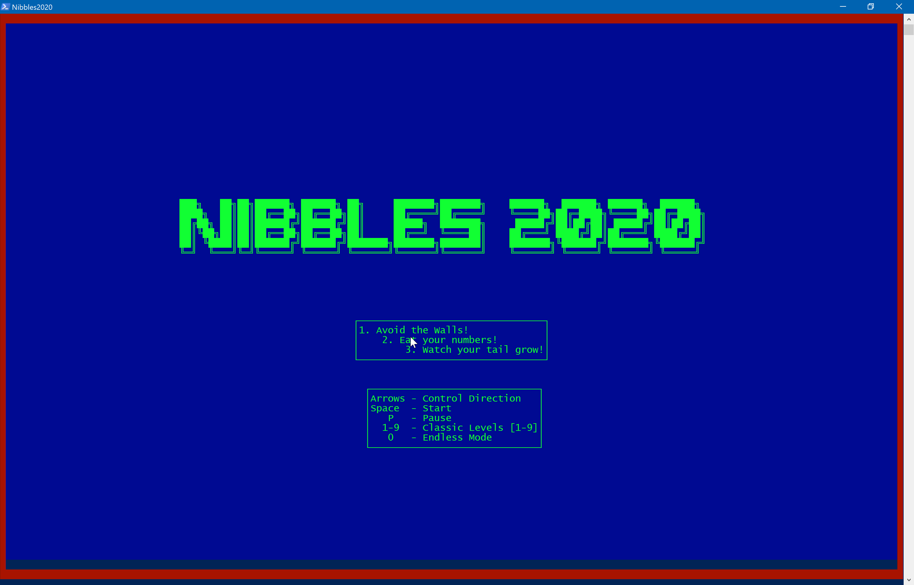
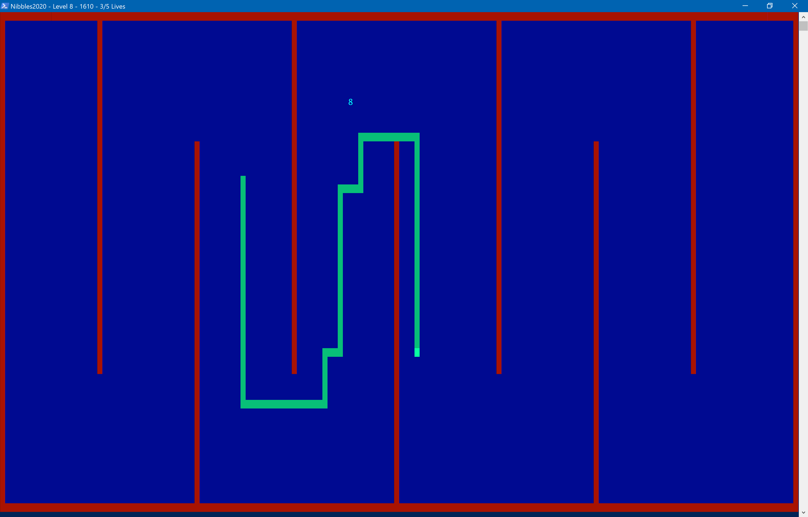
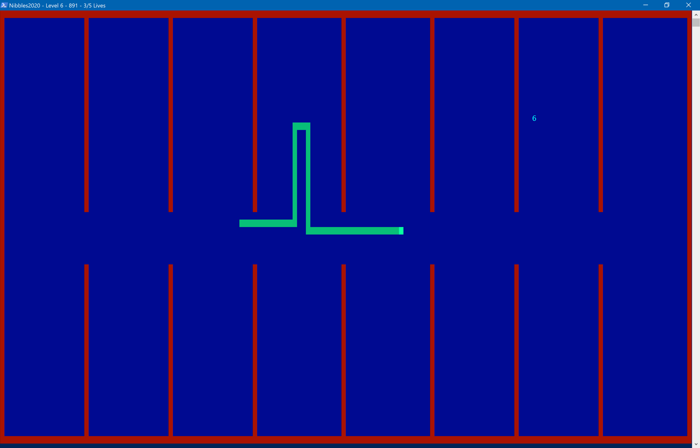
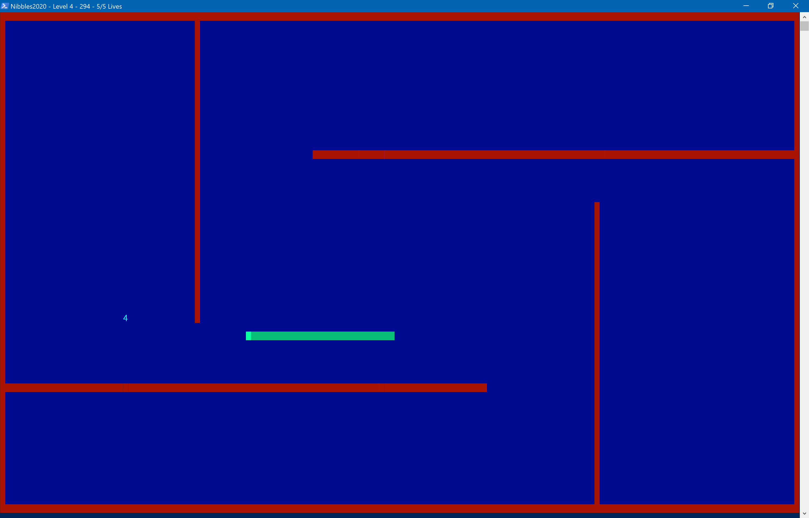
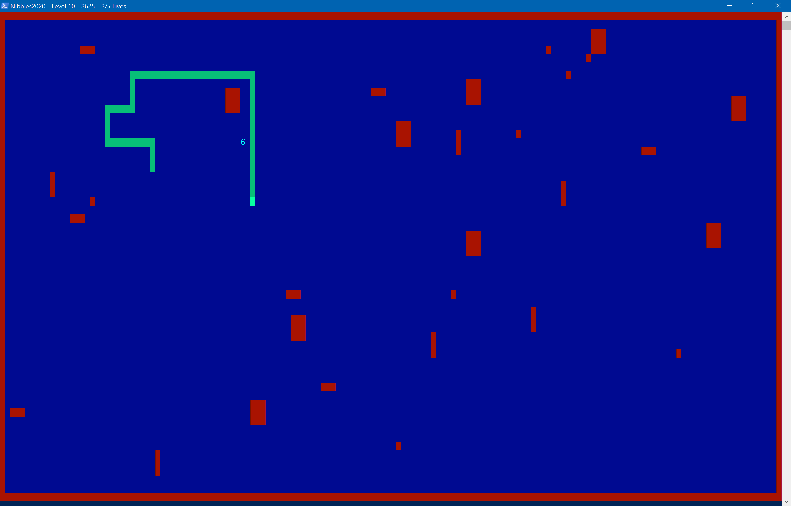
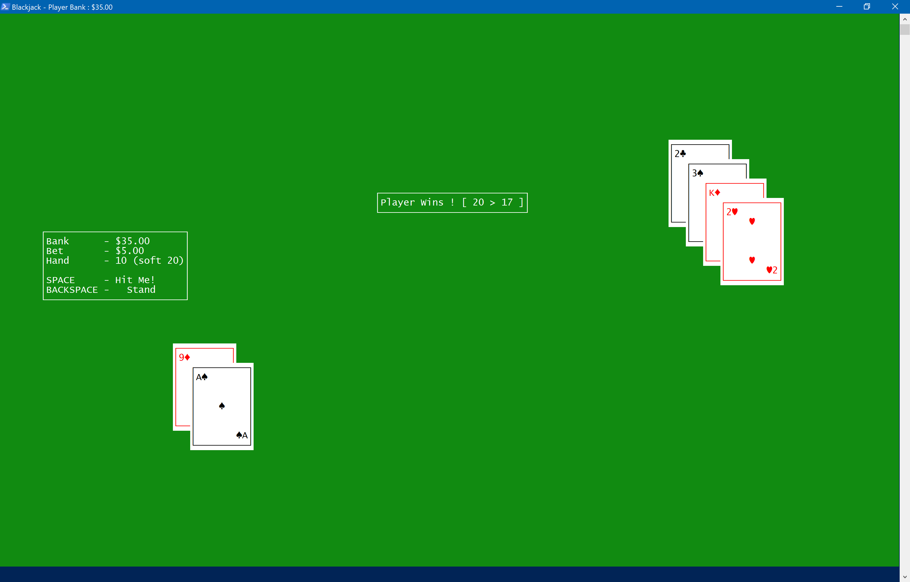

# PowerArcade| Retro Gaming in PowerShell

## April 1, 2020: 

At Start-Automating, we believe PowerShell can power anything.  
PowerShell has helped almost every area of automation, and has been used to build Winforms, WPF, and web applications.  
Certain members of the PowerShell team made [legendary HTML5 prototypes](https://www.leeholmes.com/blog/2011/04/01/powershell-and-html5/).

This year, we set out to build a Game Console and Development Kit in PowerShell

### Introducing PowerArcade

PowerArcade is a Game Console for your System Console.

You can quickly and easily build build cross-platform games and share them on the PowerShell Gallery.

Compared to their old Console counterparts, PowerArcade is HD.  Old Console games used a resolution of 80x50.
PowerArcade can use any resolution your terminal can handle, which nowadays can be almost 200 characters wide!
Plus we _could_ add a nicer rendering engine to it, if we ever get around to it.

Like all Consoles, PowerArcade ships with a game.

We decided to do a retro update of the classic Nibbles.bas.  Check it out:

### Installing and Playing

You can Install PowerArcade from the PowerShell Gallery:

~~~
Install-Module PowerArcade -Scope CurrentUser
~~~

Then you can start playing Nibbles right away with:

~~~
Start-Game Nibbles2020 
~~~

Want more games?  You can use Find-Game to find them and Install-Game to install them.

~~~
Find-Game # see what's out there
~~~

You can pipe Find-Game to Install-Game, then just Start-Game
~~~
Find-Game Blackjack | Install-Game
Start-Game Blackjack
~~~

### How does it work?

Nibbles.bas is a fitting choice, as Nibbles was a demostration of building games in QBASIC.
While PowerShell is not a direct ancestor of QBASIC, it is a successor to Visual Basic.  
A few attempted to create games using Visual Basic, but [no developers were known to survive the process](https://youtu.be/WGqD-J_pRvs).

Anyhow, developing games in PowerArcade is considerably less likely to be lethal.

Let's take a look at how Nibbles works.  Here's it's file tree (courtesy of [EZOut](https://github.com/StartAutomating/EZOut)):

~~~
├──Game
    ├──Game.ps1
    ├──Game.psd1
    ├──OnKey_Down.ps1
    ├──OnKey_Esc.ps1
    ├──OnKey_Left.ps1
    ├──OnKey_P.ps1
    ├──OnKey_Right.ps1
    ├──OnKey_Up.ps1
    ├──Over.ps1
├──Levels
    ├──Levels.ps1
    ├──1
        ├──1.ps1
    ├──2
        ├──2.ps1
    ├──3
        ├──3.ps1
    ├──4
        ├──4.ps1
    ├──5
        ├──5.ps1
    ├──6
        ├──6.ps1
    ├──7
        ├──7.ps1
    ├──8
        ├──8.ps1
    ├──9
        ├──9.ps1
    ├──GameOver
        ├──GameOver.ps1
        ├──OnKey_All.ps1
    ├──Menu
        ├──Menu.ps1
        ├──OnKey_All.ps1
    ├──Pause
        ├──Pause.ps1
├──Sprites
    ├──Number
        ├──Number.psd1
    ├──Snake
        ├──+.ps1
        ├──+Number.ps1
        ├──+Wall,Tail,Snake.ps1
        ├──Dies.ps1
        ├──OnTick.ps1
        ├──Snake.psd1
        ├──SwitchDirection.ps1
    ├──Wall
        ├──Wall.psd1
├──Nibbles2020.psd1
~~~

A game is made of a module and up to three subdirectories:

#### The Game Directory

The Game directory contains a Game.psd1 which has initial settings for the game.

A Game.ps1 file, if found, will be run when the game starts to initialize the game.

Any other .ps1 files become methods of the Game, which can be accessed with running in a global variable called $game (duh).

Any methods named On* denote an event handler.  OnTick will be called when the game clock ticks.
Files named OnKey_KeyName.ps1 will handle specific key presses.

#### The Levels directory

The Levels directory defines game levels.  Pretty easy to navigate, right?

Each named subdirectory is the name of a level.  A script sharing the directory name will initialize the level.

These named subdirectories work like the game directory, and can also handle keys.

If there is Levels.ps1 beneath levels, it will be called before the level initializes.

#### The Sprites directory

Sprites are magical game creatures that move about in the imaginary world of the game.

Just like each Levels directory, a Sprite can have an initializer (e.g. Unicorn\Unicorn.ps1) 
and can also have default properties (e.g. Unicorn\Unicorn.psd1)

Sprites cannot respond to key presses, but they can respond to game ticks.

Additionally, Sprites can have interaction methods.  These describe what happens with two Sprites meet.

In Nibbles, Sprites\Snake\+Number.ps1 descibes what happens when a snake hits a number, 
and \Sprites\Snake\+Wall,Tail,Snake.ps1 describes what happens when a snake hits a wall, tail, or a snake.

That's about it.  Inside your methods you can do whatever your game logic needs, 
and you can use Add-Sprite, Find-Sprite, Move-Sprite, and Remove-Sprite to control the sprites on the screen.

### Playing around and contributing

This is mostly in good fun, but feedback, contributions, and game submissions are welcome.
